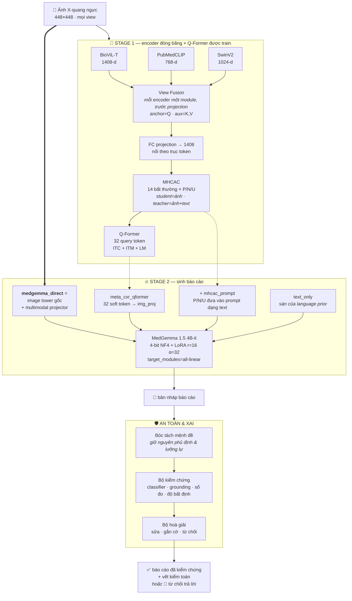
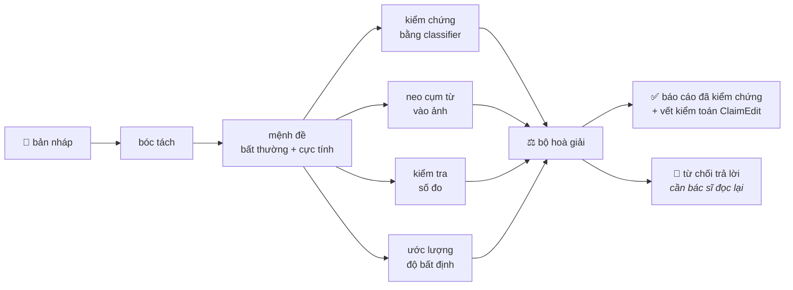

<div align="center">

# 🫁 META-CXR

### Sinh báo cáo X-quang ngực có dẫn hướng bất thường bằng mô hình thị giác – ngôn ngữ

*Đa encoder thị giác · expert query tokens · giải mã bằng MedGemma · kiểm chứng ở mức mệnh đề*


</div>

---

> [!WARNING]
> **Trạng thái thật của repo.** Codebase này đã khác rất nhiều so với bài báo đã công bố.
> Stage 1 và Stage 2 đã **hoàn chỉnh về mã nguồn và được phủ bởi 430 CPU test**, nhưng
> **chưa có phần nào của bản viết lại hiện tại từng chạy trên GPU.** Mọi shape, câu lệnh và con số
> chi phí bên dưới đều được suy ra từ source code, **không** phải từ một lần train quan sát được.
> Các chỉ số ở mục [📊 Kết quả](#-kết-quả) là số **của bài báo** cho kiến trúc **cũ** và **chưa**
> được reproduce bởi code này. Hãy xem đó là mục tiêu cần đạt, không phải kết quả đang có.

---

## 📚 Mục lục

- [Những gì đã thay đổi so với bài báo](#-những-gì-đã-thay-đổi-so-với-bài-báo)
- [Kiến trúc tổng quan](#-kiến-trúc-tổng-quan)
- [Stage 1 — căn chỉnh có dẫn hướng bất thường](#-stage-1--căn-chỉnh-có-dẫn-hướng-bất-thường)
- [Stage 2 — sinh báo cáo](#-stage-2--sinh-báo-cáo)
- [Nhánh MedGemma ngoài](#-nhánh-medgemma-ngoài)
- [Tầng an toàn & XAI](#-tầng-an-toàn--xai)
- [Đánh giá](#-đánh-giá)
- [Pipeline dữ liệu](#-pipeline-dữ-liệu)
- [Bắt đầu nhanh](#-bắt-đầu-nhanh)
- [Bản đồ repository](#-bản-đồ-repository)
- [Kiểm thử](#-kiểm-thử)
- [Những gì CỐ TÌNH không có ở đây](#-những-gì-cố-tình-không-có-ở-đây)
- [Kết quả](#-kết-quả)
- [Trích dẫn](#-trích-dẫn)

---

## 🔄 Những gì đã thay đổi so với bài báo

Bài báo mô tả một pipeline duy nhất: đa encoder thị giác → Q-Former → **Vicuna-7B + LoRA**.
Code hiện tại hỗ trợ **bốn kiến trúc tường minh**, đổi decoder mặc định, và bổ sung nguyên một tầng
kiểm chứng vốn không tồn tại lúc công bố.

| | 📄 Bài báo (IEEE Access, 09/2025) | 💻 Codebase hiện tại |
|---|---|---|
| **Decoder** | Vicuna-7B + LoRA | **MedGemma 1.5 4B-it + QLoRA** (mặc định) |
| **Đường ảnh vào LLM** | Chỉ qua Q-Former soft token | **Image tower gốc của MedGemma** (mặc định); Q-Former giờ là *ablation* |
| **Phụ thuộc Stage 1** | Luôn bắt buộc | **Không bắt buộc** với pipeline mặc định |
| **Phần báo cáo** | Chỉ FINDINGS | **FINDINGS + IMPRESSION**, chấm điểm tách biệt |
| **Study nhiều view** | Một ảnh | **View fusion**, một module cho mỗi encoder, sampling theo study |
| **Phạm vi dữ liệu** | Tập con p10 | **Toàn bộ p10–p19** — 365k ảnh / 220k study |
| **Cách đặt tên kiến trúc** | `--image-mode {native,qformer}` | **`--pipeline-mode`** — gọi tên kiến trúc, không phải chi tiết cài đặt |
| **Kiểm soát ảo giác** | ❌ không có | ✅ **verify → reconcile → abstain ở mức mệnh đề** |
| **Kiểm toán phụ thuộc ảnh** | ❌ không có | ✅ **bộ nhiễu loạn phản thực (counterfactual)** |
| **Clinical metrics** | có báo cáo | ❌ **đã gỡ** — repo không cài đặt cái nào; giờ gọi tới là **báo lỗi** |
| **Test** | — | **430 CPU test**, không cần GPU hay dữ liệu |

<details>
<summary><b>Vì sao đổi decoder</b></summary>

Vicuna-7B chỉ tiếp cận được ảnh **thông qua** Q-Former, nghĩa là mọi thí nghiệm Stage 2 đều nằm sau
một checkpoint Stage 1. MedGemma có sẵn một SigLIP tower đã pretrain trên dữ liệu y khoa và
multimodal projector riêng, nên pipeline mặc định đọc thẳng pixel.

Chính việc tách rời đó mới cho phép làm ablation trung thực: `medgemma_direct` và `meta_cxr_qformer`
giờ khác nhau đúng **một** thứ — đường đi của thông tin thị giác — thay vì khác nhau ở chuyện
Stage 1 có chạy hay không.

`inference.py` (Gradio UI) **chưa được migrate** và vẫn đang chạy Vicuna-7B.
</details>

---

## 🏗 Kiến trúc tổng quan



> **Chú ý hướng mũi tên.** Mũi tên đậm (`IMG ==> medgemma_direct`) là đường mặc định — ảnh đi thẳng
> tới decoder mà **không đi qua Stage 1**. Các mũi tên nét đứt là ablation.

---

## 🧊 Stage 1 — căn chỉnh có dẫn hướng bất thường

Toàn bộ Stage 1 **đóng băng, trừ Q-Former, MHCAC và các lớp fusion/projection**.

### Encoder thị giác

Encoder nào được bật do `model.encoders.*` trong file YAML của run quyết định. Cả hai config đi kèm
đều bật **BioViL-T + PubMedCLIP + SwinV2**, có sẵn RadDINO nhưng đang tắt.

### 🔀 View fusion — `mhcac/view_fusion.py`

121.738 trong tổng số 220.216 study huấn luyện có nhiều hơn một view. Fusion lấy token của view
**anchor** làm Query, các view **phụ** làm Key/Value.

| Tính chất | Vì sao quan trọng |
|---|---|
| Hợp đồng shape `[B,P,D] → [B,P,D]` | MHCAC và Q-Former **không cần sửa gì cả** |
| `W_O` + Linear cuối của FFN khởi tạo bằng 0 | Block là **identity chính xác tại step 0** — nạp checkpoint single-view không bị suy giảm |
| Study không có view phụ bị **gate về 0** | Không tách khỏi batch; không sinh ra lỗi batch răng cưa |
| **Một module cho mỗi encoder** | Fusion chạy trên output thô của từng encoder, *trước* các FC projection |

### 🎯 MHCAC — phân loại bằng multi-head cross-attention

14 bất thường × 3 lớp (**Positive / Negative / Uncertain**). `mhcac_12.py` là biến thể được nối vào
`blip2_qformer.py`; các biến thể 1–11 giữ lại để tham khảo.

> [!IMPORTANT]
> **Teacher chỉ tồn tại lúc train.** Cross-attention với text bị chặn bởi `num_text_teacher_layers`,
> nên **nhánh student không bao giờ nhìn thấy text báo cáo**. Inference chạy nhánh student. Teacher
> được chưng cất vào student qua `soft_target_kl_loss` với teacher đã `detach`.
> `tests/test_shared_visual_tokens.py` và `tests/test_native_independence.py` canh giữ ranh giới này.

### Họ hàm mất mát — `mhcac/loss.py`

| Loss | Vai trò |
|---|---|
| `ClassificationLoss` | Nhận `sample_mask` — dòng chưa gán nhãn đóng góp **bằng 0** |
| `soft_target_kl_loss` | Chưng cất teacher → student, teacher đã detach |
| `AbnormalitySpecificLoss` | Trọng số riêng theo từng bất thường |
| `AttentionLoss` | Giám sát bản đồ attention |
| `MultiPositiveContrastiveLoss` | `lambda_mpc: 0.1` |
| `view_consistency_loss` | `lambda_view_consistency: 0.05` |

Masking chính là điểm mấu chốt: **4.851 dòng train (1,33%) không có nhãn CheXpert.** Chúng vẫn được
dùng để train sinh báo cáo và bị mask khỏi loss phân loại, thay vì bị vứt bỏ.

### Recipe production — `pretraining/configs/mimic_cxr_full_l4.yaml`

```yaml
multi_view: true               # BẬT
study_sampling: true           # một dòng cho mỗi STUDY, không phải mỗi ảnh
anchor_priority: [PA, AP, lateral]
max_aux_views: 1
lambda_mpc: 0.1
lambda_view_consistency: 0.05
warmup_steps: 300              # đếm theo LẦN CẬP NHẬT optimizer, không phải microbatch (~3% của run 3 epoch)
save_freq: 0                   # chỉ giữ checkpoint_last + checkpoint_best
selection_metric: f1_positive_macro
```

> [!CAUTION]
> `mimic_cxr_2gpu.yaml` là **legacy** — nó vẫn để `multi_view: false`, `lambda_mpc: 0.0` và
> `warmup_steps: 32000` (giá trị này không bao giờ kết thúc được giai đoạn ramp). Đừng copy số từ đó.
> Lưu ý thêm: khối `data:` phải nằm **bên trong** `model:`, vì `Config` chỉ merge `run`/`model`/`datasets`.

**Chọn checkpoint:** `checkpoint_best.pth` được cập nhật mỗi khi `f1_positive_macro` cải thiện, tính
trên **toàn bộ** tập validation. Tập **test bị giữ hoàn toàn ngoài quá trình chọn checkpoint** và chỉ
được đánh giá một lần, từ `checkpoint_best`, sau khi train xong.

---

## 🔥 Stage 2 — sinh báo cáo

### Bốn kiến trúc — `training/pipeline_modes.py`

| Mode | Đường thị giác | Cần Stage 1? | Ghi chú |
|---|---|---|---|
| ⭐ **`medgemma_direct`** | Image tower + projector gốc của MedGemma | ❌ không | **Mặc định.** Không Q-Former, không MHCAC, không đưa findings có cấu trúc vào prompt. Ảnh là bằng chứng lâm sàng *duy nhất*. |
| `meta_cxr_qformer` | 32 token Q-Former → `img_proj` → soft token | ✅ có | Ablation lai. **Đây KHÔNG phải native MedGemma** — tên mode giờ nói rõ điều đó. |
| `meta_cxr_qformer_with_mhcac_prompt` | như trên **+** P/N/U đưa vào prompt dạng text | ✅ có | Kiểm tra xem findings có cấu trúc có giúp thêm gì trên nền soft token không |
| `text_only_language_prior_ablation` | 🚫 **hoàn toàn không có ảnh** | ❌ không | **Ablation chẩn đoán.** Đo xem bao nhiêu phần báo cáo khôi phục được chỉ từ language prior. Phải gọi tên tường minh; không bao giờ vô tình rơi vào. |
| `both_for_ablation` | chạy `medgemma_direct`, *rồi* `meta_cxr_qformer` | ✅ có | Pipeline chính chạy trước, nên nếu ablation crash thì kết quả chính vẫn còn trên đĩa |

<details>
<summary><b>Cơ chế thay thế soft token thực sự hoạt động thế nào</b></summary>

```
Q-Former output [B,32,768]
  → img_proj (Linear fp32, có train) → [B,32,hidden]
  → THAY THẾ tại 32 vị trí <qformer_soft_token>   ← thay thế, KHÔNG phải cộng vào
  → Gemma decoder (+ QLoRA)
```

Là **thay thế**, không phải cộng. `training/medgemma/soft_tokens.py` giữ bộ injector;
`tests/test_soft_token_injection.py` kiểm tra hợp đồng batch.

Decoder: `google/medgemma-1.5-4b-it`, nạp 4-bit NF4 (double quant, tính toán bfloat16), LoRA
`r=16, alpha=32, target_modules="all-linear"` — đây là default của CLI trong `run_medgemma_qlora.py`.
`img_proj` train với learning rate cao hơn (`--projector-lr 1e-3`) so với adapter (`--lora-lr 1e-4`).
</details>

### Section mode

| Mode | Đích cần sinh |
|---|---|
| `findings_only` | chỉ text FINDINGS |
| `impression_only` | chỉ text IMPRESSION |
| ⭐ `findings_and_impression` | `FINDINGS: …\n\nIMPRESSION: …` (**mặc định**) |

`findings_and_impression` yêu cầu **cả hai** phần đều hợp lệ — dòng chỉ có một phần bị loại bỏ chứ
không train với một section rỗng. `split_generated_report` coi một đoạn sinh ra không có tiêu đề là
FINDINGS với IMPRESSION *rỗng*, nên việc bỏ sót impression sẽ bị tính là **trượt** thay vì bị âm thầm
nhân bản. `max_new_tokens` tự co giãn: 512 cho hai section, 256 cho các trường hợp còn lại.

> [!NOTE]
> **Các mode Q-Former chỉ chạy được FINDINGS.** `ReportDataset.text_output` không sinh impression, nên
> một mode Q-Former đi kèm `--section-mode findings_and_impression` sẽ **báo lỗi và dừng**, thay vì
> âm thầm train nhánh lai trên một đích khác với pipeline chính.

### Nguyên tắc "hỏng thì dừng, không xuống cấp"

Một chủ đề xuyên suốt codebase này: **pipeline bị suy giảm thì raise lỗi, chứ không tự hạ cấp.**

- `medgemma_direct` **từ chối im lặng rơi về text-only** — một model nạp lên mà thiếu vision tower sẽ
  viết ra báo cáo nghe rất hợp lý dù chưa từng nhìn thấy một pixel nào. `requires_multimodal` là `True`
  với mọi mode, trừ đúng một ablation cố ý.
- `NotMultimodalError` được raise ngay lúc nạp model, chứ không để phát hiện lúc eval.

**Chỉ hỗ trợ một GPU.** `device_map` ghim vào `torch.cuda.current_device()`. Trong repo này **không có
DDP, FSDP hay DistributedSampler** ở bất kỳ đâu — đừng tuyên bố hỗ trợ đa GPU.

### 📝 Thiết kế prompt Stage 2 (v2)

`stage2/prompts/` là **một** prompt builder dùng chung, có version, không phụ thuộc torch, được **cả
train lẫn inference gọi** (`VariantLLM._render_prompt_text` → `PromptBuilder`). Chi tiết ở
`docs/stage2_prompt_design.md`; audit prompt cũ ở `docs/stage2_prompt_audit.md`.

Nguyên tắc:

- **Bằng chứng thị giác là chính**; prediction Stage 1 chỉ là *gợi ý phụ có thể sai* ("Auxiliary
  Stage-1 predictions, which may be imperfect").
- Study bình thường **không** liệt kê 13 negative — dùng `normal_policy` (mặc định `compact_summary`).
- Uncertain **không** bị biến thành positive; hiển thị ở nhóm "Possible or uncertain".
- Chọn negative bằng `negative_policy` (mặc định `critical_only`, cap `max_negative_findings`).
- Không có prior → prompt **cấm** từ ngữ so sánh thời gian (`forbid_comparison_without_prior`).
- `native_anchor_only` (image-only) khác `qformer_guided`: mode sau có structured cues, mode trước không.
- Đổi prompt bằng YAML: `configs/stage2_prompt_v2.yaml`; ablation ở `configs/prompt_ablation/`.
- Tái lập: mỗi run ghi `prompt_version`, `config_hash`, `template_hash` vào adapter manifest.

```bash
# Export prompt debug (synthetic nếu không có --input)
python scripts/export_stage2_prompt_samples.py --config configs/stage2_prompt_v2.yaml \
  --num-samples 50 --output outputs/prompt_samples.jsonl

# Thống kê độ dài prompt/target
python scripts/prompt_length_statistics.py --config configs/stage2_prompt_v2.yaml \
  --tokenizer google/medgemma-1.5-4b-it --max-length 768

# Ablation (dry-run, KHÔNG train, KHÔNG sinh metric)
python scripts/run_prompt_ablation.py --prompt-configs configs/prompt_ablation/P*.yaml \
  --max-samples 1000 --output-dir outputs/prompt_ablation

# Train với prompt v2 (opt-in; bỏ --prompt-config để giữ prompt legacy)
python training/run_medgemma_qlora.py --pipeline-mode meta_cxr_qformer \
  --section-mode findings_only --prompt-config configs/stage2_prompt_v2.yaml
```

Prompt v2 là **opt-in** và **backward-compatible**: bỏ `--prompt-config` thì prompt legacy giữ nguyên
byte-for-byte, checkpoint cũ không bị ảnh hưởng. Builder đã có unit test CPU; phần nối vào `VariantLLM`
(chat template/generation) **chưa chạy trên GPU** — không có metric mô hình nào ở đây đến từ prompt v2.

---

## 🌍 Nhánh MedGemma ngoài

Một nhánh riêng, **chỉ inference**, dùng để đánh giá một checkpoint của bên thứ ba trên split có
kiểm soát của chúng ta.

```
erjui/medgemma-4b-srrg-findings
  ↳ được BÊN THỨ BA fine-tune từ google/medgemma-4b-it
  ↳ trên csrrg_ift (dẫn xuất từ MIMIC-CXR + CheXpert+)
  ↳ KHÔNG do dự án này fine-tune · KHÔNG train trên split của repo này
```

> [!IMPORTANT]
> Mọi chỉ số từ nhánh này phải được báo cáo như **đánh giá baseline bên ngoài**, tuyệt đối không được
> ghi là mô hình của dự án. Mỗi bản ghi dự đoán đều mang cờ nguồn gốc `external_checkpoint` và
> `fine_tuned_by_this_project`, để về sau không thể nhầm lẫn file kết quả.

### 💰 Kiểm soát ngân sách — `runtime/budget.py`

GPU thuê tính tiền theo **thời gian đồng hồ, không theo số mẫu** — một run bị treo tốn đúng bằng một
run đang chạy hiệu quả, nên nó được đo theo đúng cách đó.

- Bộ điều khiển **chỉ có quyền dừng** một run. Nó không bao giờ leo thang: chạm ngân sách không kéo
  theo việc rơi xuống model rẻ hơn, và hoàn thành Findings **không** tự bật Impression.
- `prior_elapsed_seconds` được mang theo qua các lần resume, nên không thể resume vô hạn để vượt trần.
- Model được khởi tạo **lazy** — một run đã resume xong hoàn toàn thì tốn 0 giờ GPU.
- `--max-samples all` bắt buộc phải có `--confirm-full-run`. Không bao giờ vô tình chạy hết cả split.

### 🚦 Chốt chặn theo giai đoạn

**Phase 2 (Impression) đã được khai báo nhưng bị vô hiệu hoá.** `assert_impression_disabled` chạy
*trước* khi bất kỳ thứ gì được nạp, nên một cấu hình sai sẽ fail trong vài mili-giây thay vì fail sau
khi đã tải về một checkpoint 4B thứ hai. **Không có flag nào bỏ qua được chốt chặn này.** Nếu model tự
ý sinh thêm IMPRESSION, bộ hậu xử lý sẽ **bỏ đi** và ghi cảnh báo `unexpected_impression_generated`.

Xem [`docs/gpu_pilot_checklist.md`](gpu_pilot_checklist.md) cho quy trình pilot theo thứ tự
1 → 10 → 100 → 500 → full và các điều kiện nghiệm thu.

---

## 🛡 Tầng an toàn & XAI

BLEU và BERTScore chấm điểm báo cáo *như một khối* — chúng không thể chỉ ra **câu nào sai**. Tầng này
làm việc ở mức mệnh đề (claim) thay vì mức văn bản.



### Ba quy tắc bóc tách rất dễ làm sai

| Quy tắc | Lỗi mà nó ngăn chặn |
|---|---|
| **Phủ định được phát hiện, không bao giờ bị xoá** | *"No pneumothorax"* là một **mệnh đề phủ định VỀ tràn khí màng phổi** — không phải là "không có mệnh đề nào", và càng không phải một mệnh đề khẳng định. Xoá dấu hiệu phủ định để "làm sạch" text sẽ **đảo ngược ý nghĩa lâm sàng**. |
| **Lưỡng lự là một cực tính riêng** | *"cannot exclude pneumonia"* không phải khẳng định, cũng không phải phủ định. Ép nó về một trong hai phía là một sai sót về sự thật. |
| **Câu không khớp thì không sinh mệnh đề nào** | Sự im lặng được báo cáo ở downstream dưới dạng `parse_coverage`, nên không thể bị nhầm là "đã kiểm chứng". |

### Bốn kết cục của bộ kiểm chứng — không phải hai

```
supported / contradicted   → bộ kiểm chứng đã chạy và có kết luận
inconclusive               → đã chạy nhưng không quyết được
unavailable                → HOÀN TOÀN KHÔNG CHẠY ĐƯỢC
```

> [!WARNING]
> Gộp **`unavailable` vào `contradicted`** chính là lỗi mà module này sinh ra để ngăn chặn. Nếu một
> model grounding bị thiếu mà lại được hiểu thành "không neo được vào ảnh", bộ hoà giải sẽ cắt bỏ mọi
> phát hiện dương tính **đúng** khỏi mọi báo cáo — và pipeline sẽ *trông như đang chạy tốt*.

### Chính sách hoà giải

1. nháp dương + classifier âm (+ grounding không ủng hộ) → khẳng định dương **không được giữ nguyên**
2. nháp âm + classifier dương (+ grounding ủng hộ) → gắn cờ **có thể bỏ sót**; không bao giờ tự ý viết lại thành dương
3. một số đo không xác nhận được → **xoá con số đi**, đưa mệnh đề sang diện cần review
4. độ bất định vượt ngưỡng → chuyển sang ngôn ngữ thận trọng, hoặc từ chối trả lời
5. bằng chứng không đủ → nói thẳng *"insufficient evidence"*, thay vì phát biểu tự tin
6. **mọi chỉnh sửa đều mang vết kiểm toán** — cả quy tắc đã kích hoạt *lẫn* những tiền đề thực sự được đánh giá

Những câu không sinh ra mệnh đề nào sẽ bị **loại khỏi báo cáo cuối**, chứ không được cho đi qua mà
không kiểm tra: bất cứ thứ gì có trong output đều đã đi qua pipeline. `parse_coverage` được đưa ra
ngoài vì một pipeline chỉ bóc tách được 2 trên 12 câu thì thực chất **chưa kiểm tra** báo cáo đó, dù
các con số ở mức mệnh đề trông có đẹp đến đâu.

### 🔬 Kiểm toán phản thực — báo cáo có thực sự phụ thuộc vào ảnh không?

Một bộ sinh báo cáo dựa hơi vào language prior vẫn có thể đạt điểm BLEU/CIDEr cao dù gần như không
đọc phim — *"no acute cardiopulmonary process"* vốn đã là một phỏng đoán tốt trước khi nhìn thấy pixel
nào. Các chỉ số NLG **không** phát hiện được chuyện này. Nhiễu loạn ảnh rồi đo xem báo cáo dịch chuyển
bao nhiêu thì phát hiện được.

| Nhiễu loạn | Phá huỷ cái gì | Nếu output gần như không đổi thì nghĩa là |
|---|---|---|
| `no_image` / `blank_image` / `constant_image` | toàn bộ ảnh | đang viết từ **language prior**, không phải từ phim |
| `shuffled_pixels` | cấu trúc không gian (giữ histogram cường độ) | đang dùng **độ phơi sáng tổng thể**, không phải giải phẫu |
| `shuffled_patches` | giải phẫu toàn cục (giữ texture cục bộ) | đang dùng texture, không phải cấu trúc |
| `random_image_swap` / `hard_negative_swap` | thay bằng **một study có thật khác** | phép thử mạnh nhất — một hard negative vẫn phải làm báo cáo dịch chuyển |
| `region_occlusion` | một vùng giải phẫu | các khẳng định về vị trí là vô căn cứ |

Mọi nhiễu loạn đều **tất định khi cho trước seed**, nên một lần kiểm toán là tái lập được. Bộ đánh giá
không phụ thuộc model cụ thể (dùng protocol `ReportGenerationBackend`), nên chạy được với MedGemma
thật trên GPU, hoặc với một fake tất định trên CPU trong test suite.

> [!NOTE]
> `text_change` là thước đo **từ vựng** — khoảng cách Jaccard ở mức token, và được đặt tên là
> `lexical_text_change` trong output schema đúng vì lý do đó. Nó **không phải** thước đo lâm sàng.
> Hai báo cáo có thể khác nhau về từ ngữ nhưng giống hệt về lâm sàng, hoặc gần như y hệt nhau mà lại
> khác đúng ở một từ quyết định (*"no pneumothorax"* vs *"pneumothorax"*).

### 🔒 Riêng tư ngay từ thiết kế

Các bản ghi an toàn và dự đoán **không chứa `subject_id`, `study_id`, `dicom_id`, đường dẫn tuyệt đối
hay báo cáo tham chiếu**. `sample_key` là một digest đã salt. Output an toàn để lưu cạnh các artifact
đánh giá khác. `scripts/check_notebook_privacy.py` canh giữ notebook trong CI.

---

## 📏 Đánh giá

> [!WARNING]
> **Các kết quả trong README gốc hoặc trong bài báo KHÔNG phải kết quả thực nghiệm của repository
> này**, nếu chưa được chạy lại và xác nhận. Xem [📊 Kết quả](#-kết-quả).
> Chưa có lần inference nào trên MIMIC-CXR được thực hiện với code hiện tại.

### Vì sao accuracy là một chỉ số gây hiểu lầm

Trên MIMIC-CXR phần lớn cặp (study, pathology) là âm tính. Một mô hình **không bao giờ dự đoán
positive** vẫn đạt accuracy rất cao. Số đo thật từ [`docs/evaluator_validation.md`](evaluator_validation.md),
với prevalence 5%:

```
binary_accuracy    = 0.9617   ← trông rất tốt
positive_macro_f1  = 0.0000   ← không phát hiện được gì cả
```

Vì vậy evaluator **luôn** in kèm bảng baseline. Nếu accuracy của mô hình xấp xỉ hàng
`all_negative` trong khi positive macro F1 gần 0, mô hình chưa học được gì — bất kể con số
accuracy nói gì.

### Vì sao dùng positive macro F1, và vì sao cần AUPRC

| Chỉ số | Vai trò |
|---|---|
| **Positive macro F1** | Chỉ tính class positive, trung bình **theo pathology** — nên pathology hiếm có trọng số ngang pathology phổ biến. Đây là selection metric của Stage 1. |
| **AUPRC** | Với positive hiếm, AUROC vẫn đẹp trong khi AUPRC lộ ra sự thật. Đo thật ở prevalence 1%: **AUROC = 0.7525** nhưng **AUPRC = 0.5100**. |
| **Macro vs micro** | Macro = trung bình theo pathology; micro = gộp tp/fp/fn. Đo thật: **macro 0.5000 vs micro 0.6667** trên cùng dữ liệu. |

> [!IMPORTANT]
> **Một pathology không có mẫu positive nào trong split sẽ bị LOẠI khỏi macro**, không bị tính là
> 0. Evaluator cũ tính nó thành 0, khiến `f1_positive_macro` dịch chuyển theo phân bố của split và
> val/test không so sánh được. Chiều ngược lại cũng được chặn: pathology *có* positive mà mô hình
> không dự đoán gì vẫn giữ F1 = 0 và **ở lại** trong macro — nếu không, một mô hình dự đoán rỗng
> sẽ đạt macro hoàn hảo.

### Threshold calibration — và vì sao không bao giờ calibrate trên test

Mỗi pathology có một threshold riêng cho class positive, **chỉ fit trên validation**.

```
threshold 0.5    → positive_macro_f1 = 0.0000
calibrated 0.350 → positive_macro_f1 = 1.0000
```

Threshold fit trên test là một siêu tham số fit trên test — mọi chỉ số test sau đó đều bị lệch lạc
quan. Hai lớp chặn được cài cứng:

- `calibrate_thresholds()` **từ chối** một split tên là `test` (CLI trả exit code 2).
- `load_thresholds()` **từ chối** file threshold có metadata ghi `split: test`.

### Chạy đánh giá

```bash
# 1. Calibrate ngưỡng trên VALIDATION
python scripts/calibrate_thresholds.py \
    --predictions outputs/validation_predictions.npz \
    --objective f1 --uncertain-policy ignore_uncertain \
    --split validation --output outputs/thresholds.json

# 2. Đánh giá TEST bằng ngưỡng đã lưu
python scripts/evaluate_stage1.py \
    --predictions outputs/test_predictions.npz \
    --thresholds outputs/thresholds.json \
    --uncertain-policy ignore_uncertain \
    --bootstrap-samples 1000 \
    --output-dir outputs/stage1_evaluation

# 3. Đánh giá báo cáo sinh ra
python scripts/evaluate_stage2.py \
    --predictions outputs/generated_reports.jsonl \
    --metrics bleu,rouge,meteor,cider,bertscore \
    --skip-clinical-metrics \
    --bootstrap-samples 1000 \
    --output-dir outputs/stage2_evaluation
```

Bật `run.save_predictions: true` trong config Stage 1 để ghi file `.npz`. Sau đó **mọi lần đánh
giá lại đều không cần GPU, không cần model, không cần dataset** — đổi uncertain policy hay
threshold rồi chạy lại chỉ tốn vài giây.

<details>
<summary><b>Tuỳ chọn thường dùng</b></summary>

| Cờ | Tác dụng |
|---|---|
| `--uncertain-policy` | `three_class` (mặc định) · `uncertain_as_positive` · `uncertain_as_negative` · `ignore_uncertain` |
| `--include-meta-labels` | Đưa `No Finding` + `Support Devices` vào macro (mặc định loại) |
| `--no-bootstrap` / `--no-plots` | Chạy nhanh khi debug |
| `--bootstrap-samples N` | Mặc định 1000, resample **theo study** |
| `--evaluation-seed N` | Tái lập; cùng seed → kết quả trùng khớp |
| `--clinical-metrics` / `--skip-clinical-metrics` | Bật/tắt CheXbert, RadGraph |
| `--include-text` | Ghi text báo cáo vào per-sample output (mặc định **tắt** — dữ liệu hạn chế) |

</details>

### Lexical metrics ≠ clinical metrics

Đây là điểm quan trọng nhất khi đọc bảng kết quả Stage 2. Hai báo cáo **đối lập hoàn toàn về lâm
sàng**, đo thật:

| | |
|---|---|
| Reference | `There is no pneumothorax.` |
| Generated | `There is a pneumothorax.` |
| **BLEU-1** | **0.8000** |
| **ROUGE-L** | **0.8000** |
| Cờ phát hiện | `possible_negation_error`, `possible_false_positive_finding` |

BLEU/ROUGE/METEOR/CIDEr/BERTScore đo **trùng lặp bề mặt**. Chúng không đo đúng sai lâm sàng.
**Một bảng chỉ có các chỉ số này không chứng minh được tính đúng đắn lâm sàng.**

### Metric thiếu dependency không bao giờ thành điểm 0

```
corpus keys      = ['bleu_1', 'bleu_2', 'bleu_3', 'bleu_4']
unavailable keys = ['bertscore', 'cider', 'meteor']
```

Metric thiếu package **không xuất hiện** trong kết quả — nó nằm trong `unavailable` kèm câu lệnh
cài đặt. Evaluator cũ (`compute_nlg`) dùng `except Exception: rouge_l = 0.0`, biến lỗi dependency
thành một con số 0 nằm trên bảng kết quả, không phân biệt được với "mô hình kém".

```bash
pip install -e ".[eval-generation]"   # nltk, pycocoevalcap, bert-score
pip install -e ".[eval-plots]"        # matplotlib
```

**CheXbert / RadGraph / RadCliQ / RadFact chưa được implement** — `training/evaluation/clinical.py`
là interface, raise lỗi tường minh thay vì trả số giả. Xem [🚫 Những gì cố tình không có](#-những-gì-cố-tình-không-có-ở-đây).

### Đọc output

```
outputs/stage1_evaluation/
├── evaluation_report.md        # metadata + baseline + per-pathology + CI + limitations
├── metrics.json                # không chứa NaN — giá trị undefined là `null` kèm lý do
├── summary.csv
├── per_pathology_metrics.csv
├── confusion_matrices/         # 1 heatmap / pathology
└── plots/                      # ROC, PR, bar F1, prevalence, histogram, reliability
```

`evaluation_report.md` ghi git commit, checkpoint, split, seed, uncertain policy, nguồn threshold
và **version của từng package metric** — một bảng số không truy được về run đã sinh ra nó thì
không dùng được trong khóa luận.

### Tái lập

```bash
python -m pytest tests/     # 430 test, ~7s, không cần GPU/dữ liệu
```

Cùng `--evaluation-seed` → kết quả trùng khớp từng chữ số (có test kiểm chứng).
Chi tiết audit evaluator cũ: [`docs/evaluator_audit.md`](evaluator_audit.md).
Kết quả kiểm chứng thủ công: [`docs/evaluator_validation.md`](evaluator_validation.md).

---

## 📊 Pipeline dữ liệu

**Phạm vi là toàn bộ dataset — p10–p19**, không phải tập con p10. Tiền xử lý đã **xong**.

| Split | Số dòng | Số study |
|---|---:|---:|
| train | 365.293 | 220.216 |
| val | 2.963 | — |
| test | 5.082 | — |

<div align="center">

**Giữ mọi view** (AP / PA / LATERAL / LL / UNKNOWN) → có `ViewPosition` → bật được `multi_view: true`
**Các split rời nhau theo cả bệnh nhân lẫn study** (đã kiểm chứng)

</div>

### Hai điểm tinh tế đáng biết

<details>
<summary><b>1. Sampling là một dòng cho mỗi <i>study</i>, không phải mỗi ảnh</b></summary>

Trước đây cả 365.293 dòng ảnh đều là mẫu độc lập — điều này khiến báo cáo bị lặp lại **145.077 lần**
và làm các study nhiều view bị đánh trọng số quá cao. Sampling theo study cũng thay đổi định nghĩa
của một "epoch", nên **mọi con số throughput từ trước thay đổi này đều đã lỗi thời.**
</details>

<details>
<summary><b>2. 32,6% báo cáo không có tag FINDINGS</b></summary>

`preporcessing/mimic_report_parser.py` **khôi phục phần thân tường thuật**, thay vì âm thầm rơi về
việc lấy nguyên cả báo cáo như hành vi trước đây.

IMPRESSION thì khác: nó **chỉ** được bóc từ tag `IMPRESSION:` / `CONCLUSION:` tường minh — không bao
giờ khôi phục từ phần thân tường thuật. Vì vậy giá trị rỗng nghĩa là báo cáo đó thực sự không có phần
impression. FINDINGS và IMPRESSION có **hai** ngưỡng độ dài **riêng** suy ra từ tập train, và không
bao giờ thay thế cho nhau.
</details>

> [!CAUTION]
> **`image_path` trong các CSV đã xử lý là đường dẫn TƯƠNG ĐỐI**
> (`files/p1X/pXXXXXXXX/sYYYYYYY/<dicom>.jpg`). `paths.mimic_cxr_jpg_root` phải trỏ tới một thư mục
> chứa trực tiếp `files/`. Đừng viết lại chúng thành đường dẫn tuyệt đối.

> [!IMPORTANT]
> **Manifest tạo trước 21/07/2026 thiếu `impression_clean` / `impression_valid` /
> `impression_token_count`** nên không phục vụ được `--section-mode findings_and_impression` mặc định.
> `assert_columns` sẽ fail và nêu đích danh các cột bị thiếu. Cần chạy lại tiền xử lý và upload lại.

### 🔐 Dữ liệu hạn chế

`Report/` chứa 227.835 file `.txt` báo cáo MIMIC-CXR (1,2 GB) — dữ liệu PhysioNet cần credential, và
DUA **cấm phân phối lại**. Điều này áp dụng y hệt cho bất kỳ notebook nào có output đã chạy in ra text
báo cáo, giá trị `findings_clean`, hay các dòng `subject_id`/`study_id`, và cho cả feature cache lẫn
file JSONL dự đoán. Các CSV split nằm trên GCS riêng tư và được mount lúc runtime; chúng **không** nằm
trong working tree.

---

## 🚀 Bắt đầu nhanh

```bash
cp configs/env_config.yaml.example configs/env_config.yaml
# điền đường dẫn dataset/output — thiếu file này local_config.py sẽ raise FileNotFoundError
```

<details open>
<summary><b>🧪 Test CPU — không cần GPU, không cần dữ liệu</b></summary>

```bash
python -m pytest tests/        # 430 test, ~7 giây
```
</details>

<details>
<summary><b>📊 Dựng lại các split</b></summary>

```bash
python preporcessing/preprocess_mimic_cxr.py \
    --raw-dir ~/data/mimic-cxr-raw \
    --reports-root ../Report/mimic-cxr-reports/files \
    --output-dir ~/data/mimic-cxr-processed/full_allviews
# --views frontal   chỉ lấy PA/AP
# --limit-studies N chạy thử nhanh
```
</details>

<details>
<summary><b>🧊 Stage 1 — căn chỉnh Q-Former</b></summary>

```bash
python -m torch.distributed.run --standalone --nproc_per_node=1 \
    -m pretraining.train --cfg-path pretraining/configs/mimic_cxr_full_l4.yaml
# hoặc: cloud/run_stage1.sh   (định danh lấy từ cloud/env.sh, không hardcode gì)
```
</details>

<details>
<summary><b>🔥 Stage 2 — sinh báo cáo</b></summary>

```bash
# Kiểm tra manifest mà quá trình train sẽ thực sự dùng (fail sớm nếu rò rỉ split)
python -m training.dataio.validate_manifest --section-mode findings_and_impression
python -m training.dataio.validate_manifest --vis-root /mnt/mimic --image-sample 500

# Mặc định: native MedGemma, findings + impression
python training/run_medgemma_qlora.py --output-dir training/outputs/medgemma_direct

# Ablation lai (cần Stage 1; chỉ FINDINGS)
python training/run_medgemma_qlora.py \
    --pipeline-mode meta_cxr_qformer \
    --section-mode findings_only \
    --checkpoint-root <dir>

# Chạy cả hai, để dựng bảng ablation
python training/run_medgemma_qlora.py \
    --pipeline-mode both_for_ablation --section-mode findings_only --checkpoint-root <dir>

# Resume (thư mục adapter được đặt tên theo pipeline mode)
python training/run_medgemma_qlora.py \
    --resume-from training/outputs/.../adapters/medgemma_qlora_medgemma_direct/checkpoints/last
```

Cờ `--image-mode {native,qformer,both}` đã deprecated nhưng vẫn chạy được, và sẽ in ra
`--pipeline-mode` tương ứng mà nó ánh xạ sang.
</details>

<details>
<summary><b>🌍 Inference findings-first với MedGemma ngoài</b></summary>

```bash
python -m medgemma_inference.run_pretrained_findings \
    --config configs/experiments/pretrained_medgemma_findings_first.yaml \
    --split validation --max-samples 100 --estimate-full-cost
```

Bắt đầu từ `--max-samples 1`. Theo đúng [`docs/gpu_pilot_checklist.md`](gpu_pilot_checklist.md) —
mỗi bước là điều kiện để mở bước sau. `--max-samples all` còn cần thêm `--confirm-full-run`.
</details>

<details>
<summary><b>🌐 Gradio inference UI (⚠️ vẫn là Vicuna-7B, chưa migrate)</b></summary>

```bash
./build_container.sh && ./run_container.sh      # → http://localhost:7860
# hoặc chạy cục bộ:
python inference.py --cfg-path pretraining/configs/blip2_pretrain_stage1_emb.yaml
```

Trọng số pretrained đặt vào `pretrainings/output/`
([Google Drive](https://drive.google.com/drive/folders/1zUT1ogIdmEjOXtBe1Vzw44uFV_ZvlcMF?usp=sharing)).
`SEED=16` được cố định để inference tất định.
</details>

### 📦 Môi trường

Stage 1 và Stage 2 ghim các phiên bản torch/transformers **không tương thích với nhau** và cài vào
**hai môi trường tách biệt** — đây chính là lý do `pyproject.toml` không khai báo runtime dependency nào.

| File | Mục tiêu |
|---|---|
| `requirements-stage1.txt` | torch 2.5.1 / CUDA 12.4, transformers 4.53.2 |
| `requirements-stage2.txt` | Stage 1 + accelerate, bitsandbytes, peft, bert-score |
| `requirements.txt` | ⚠️ pin gộp cũ — **không dùng cho môi trường mới** |

---

## 🗺 Bản đồ repository

```
META-CXR/
├── 🩻 inference.py                Gradio UI (Vicuna-7B — chưa migrate)
├── ⚙️  local_config.py             bộ nạp config trung tâm
│
├── 🧊 biovil_t/ · vision_encoders/  backbone thị giác đóng băng
├── 🎯 mhcac/                       12 biến thể MHCAC + loss.py + view_fusion.py
│                                   └─ mhcac_12.py mới là cái được nối vào
├── 🔬 model/
│   ├── lavis/                      bản fork LAVIS đã sửa (BLIP2, Q-Former)
│   └── pretrained_medgemma/        loader checkpoint ngoài + reporter + chốt chặn
│
├── 📊 preporcessing/               (sai chính tả) bộ dựng split + parser FINDINGS/IMPRESSION
├── 🧊 pretraining/                 Stage 1 train.py + configs/
│                                   └─ mimic_cxr_full_l4.yaml ⭐ production
├── 🔥 training/
│   ├── pipeline_modes.py           bốn kiến trúc (chỉ stdlib, test được trên CPU)
│   ├── run_medgemma_qlora.py       entrypoint Stage 2
│   ├── dataio/                     manifest.py + validate_manifest.py
│   ├── medgemma/                   soft_tokens.py + capabilities.py
│   ├── evaluation/                 📏 bộ đánh giá đầy đủ
│   │                               ├─ classification_metrics · threshold_calibration
│   │                               ├─ bootstrap · baselines · uncertain_policy
│   │                               ├─ generation_metrics · error_analysis
│   │                               ├─ subgroup_analysis · visualization · report_writer
│   │                               └─ counterfactual · perturbations · clinical (interface)
│   ├── trainer/                    state.py + checkpointing.py
│   └── stage1/                     lavis_loader.py
│
├── 🛡 safety/                      claims · verifiers · reconciler · pipeline
├── 🌍 medgemma_inference/          runner cho checkpoint ngoài + CLI có kiểm soát ngân sách
├── ⏱  runtime/                     budget.py · device.py
│
├── 🧪 tests/                       430 CPU test
├── 📏 scripts/                     evaluate_stage1 · evaluate_stage2 · calibrate_thresholds
├── ☁️  cloud/                       triển khai GCP (đã bỏ nhánh Kaggle)
└── 📖 docs/                        file này + 20 tài liệu làm việc
```

<details>
<summary><b>⚠️ Hai repo git lồng nhau — ba cái bẫy</b></summary>

| Repo | Remote | Nội dung |
|---|---|---|
| `META_CXR_again/` (ngoài) | **không có** | `CLAUDE.md`, `plan/`, `docs/`, `Report/` |
| `META-CXR/` (trong) | GitHub, nhánh `main` | toàn bộ source — **đây mới là thứ được push** |

1. Chạy git từ thư mục gốc dự án là đang tác động lên repo **ngoài**, vốn không có remote.
   Mọi thay đổi code phải commit **từ bên trong `META-CXR/`**.
2. `model/lavis/data/` nằm trong gitignore nhưng `ReportDataset.py` thì đã được track — `git add .`
   sẽ **không** bắt được thay đổi ở đó. Phải dùng `git add -f <path>`.
3. `configs/env_config.yaml` nằm trong gitignore **nhưng đã được track từ trước**, nên luật ignore
   không áp dụng. Hãy sửa `env_config.yaml.example` và revert file thật trước khi commit.

**Các đường dẫn đã chết.** `evaluation/`, `figures/` và `outputs/` **không tồn tại**. Tài liệu cũ có
nhắc `evaluation/eval_final_200.py` và `outputs/paper_assets.py` — đều đã chết.
Các tài liệu thời Kaggle trong `docs/` đều có banner deprecated; đừng làm theo.
</details>

---

## 🧪 Kiểm thử

```bash
python -m pytest tests/     # 430 passed, ~7 giây
```

Không cần GPU, không cần dataset, không cần mạng. Test suite thực sự canh giữ những gì:

| Hạng mục | Đảm bảo |
|---|---|
| **Mask của loss** | Dòng chưa gán nhãn đóng góp bằng 0 vào loss phân loại |
| **Tách teacher/student** | Nhánh student không bao giờ nhìn thấy text báo cáo |
| **Độc lập của native** | `medgemma_direct` không thể chạm tới bất kỳ artifact nào của Stage 1 |
| **Năng lực đa phương thức** | Một model text-only không thể âm thầm phục vụ một pipeline thị giác |
| **Scheduler** | Warmup giữ nguyên tỉ lệ `lr_scale` của từng nhóm tham số |
| **Đuôi accumulation** | Cửa sổ accumulation lẻ cuối cùng không bị bỏ |
| **Rò rỉ split** | Rời nhau theo bệnh nhân và theo study giữa train/val/test |
| **Đích của section** | FINDINGS và IMPRESSION không bao giờ bị thay thế cho nhau |
| **Batch soft token** | Hợp đồng injection đúng với mọi shape batch |
| **View fusion** | Identity tại step 0; study không có view phụ bị gate về 0 |
| **Pipeline an toàn** | Phủ định được giữ nguyên; `unavailable` ≠ `contradicted` |
| **Phản thực** | Các nhiễu loạn là tất định khi cho trước seed |
| **Tương đương khi resume** | Một run đã resume khớp với một run chạy liền mạch |
| **Riêng tư notebook** | Không notebook nào được commit làm rò rỉ text báo cáo hay định danh MIMIC |

`tests/conftest.py` đăng ký `model` / `model.lavis` là **package chỉ theo đường dẫn**, để việc import
một submodule không kích hoạt `model/lavis/__init__.py` và kéo theo cả stack GPU — không có nó thì test
suite thậm chí **không collect nổi** trên máy CPU.

Cấu hình lint nằm trong `pyproject.toml` (ruff, line-length 100). `model/lavis` bị loại trừ — format
lại một bản fork vendored sẽ khiến mọi diff upstream về sau không đọc được.

---

## 🚫 Những gì CỐ TÌNH không có ở đây

Nói rõ chuyện này chính là điểm mấu chốt. Mỗi mục dưới đây là một **khoảng trống được thừa nhận**,
không phải một thiếu sót bị bỏ quên.

| ❌ Chưa có | Trạng thái |
|---|---|
| **RadGraph / CheXbert / CheXpert-labeler / RadCliQ / GREEN** | **Không clinical metric nào được cài đặt.** `training/evaluation/clinical.py` tồn tại để khi *gọi tới* thì raise `MissingOptionalDependency` kèm câu lệnh cài đặt — thay vì trả về một con số từ vựng dưới một cái tên nghe như lâm sàng. |
| **Đa GPU (DDP / FSDP)** | Không tồn tại. Chỉ một GPU. |
| **Kết quả đã kiểm chứng trên GPU** | Chưa có phần nào của bản viết lại hiện tại chạy trên GPU. |
| **Throughput đo được** | Không có con số nào cho recipe hiện tại. Các số cũ (2× T4, p10, ~4.500 step/epoch) đã lỗi thời **gấp đôi** — phần cứng đó không còn, *và* sampling theo study đã định nghĩa lại epoch. Đo bằng `--train-limit 500 --eval-limit 10 --no-upload` rồi đọc tốc độ trên tqdm. |
| **Phase Impression (nhánh ngoài)** | Đã khai báo, **bị chốt chặn**, chưa có cài đặt nào đằng sau cái tên đó. |
| **Nguồn gốc của threshold** | `threshold.json` không mang nguồn gốc nào và **không bao giờ được nạp ngầm**. |
| **Migrate Vicuna → MedGemma trong `inference.py`** | Chưa làm. UI vẫn chạy Vicuna-7B. |
| **Chỗ để ghi checkpoint** | Các bucket GCS ghi trong `cloud/env.sh` và `env_config.yaml` **đã bị xoá (404)**. Hiện tại quá trình train không có chỗ nào để ghi. |

> **Ba nguyên tắc mà codebase này thực thi.** Không optional dependency nào được import lúc import
> module. Thiếu dependency thì raise — không bao giờ trả về một điểm số giữ chỗ. **Không có đường rơi
> ngầm** từ một clinical metric xuống một lexical metric, và việc chọn checkpoint không được phép gọi
> tên một metric không khả dụng (validate config fail *trước*, nên một run không thể train hàng giờ
> rồi mới phát hiện ra nó chẳng có gì để chọn theo).

---

## 📊 Kết quả

> [!WARNING]
> **Đây là số đã công bố trong bài báo, cho kiến trúc Vicuna-7B nguyên bản.**
> Chúng **chưa** được reproduce bởi codebase này, vốn chưa chạy trên GPU. Chúng được ghi lại ở đây như
> một **mục tiêu cần vượt**, không phải kết quả hiện có.

<div align="center">

**Phân loại bất thường — MIMIC-CXR** *(trung bình trên 13 bệnh lý + No Finding)*

| Precision | Recall | F1 |
|:---:|:---:|:---:|
| 0.87 | 0.78 | 0.73 |

**Phân loại zero-shot — CheXpert** *(5 bệnh lý)*

| Model | AUC | F1 |
|---|:---:|:---:|
| CheXzero | **0.889** | 0.606 |
| META-CXR | 0.824 | **0.699** |

**Sinh báo cáo — MIMIC-CXR**

| BERTScore | CIDEr | BLEU-4 | ROUGE-L | METEOR |
|:---:|:---:|:---:|:---:|:---:|
| 0.426 | 0.291 | 0.102 | 0.280 | 0.173 |

</div>

Các chỉ số NLG được báo cáo là BLEU / CIDEr / ROUGE / METEOR + BERTScore. **Repo này không có cài đặt
RadGraph hay RadCliQ** — đừng liệt kê chúng trong hình hay bảng.

---

## 📄 Trích dẫn

Codebase này khởi đầu là một bản cài đặt của công trình sau, và từ đó đã đi khá xa khỏi nó:

> D. Edirisinghe, W. Nimalsiri, M. Hennayake, D. Meedeniya and G. Lim,
> "Chest X-Ray Report Generation Using Abnormality Guided Vision Language Model,"
> *IEEE Access*, vol. 13, pp. 157651–157673, 2025.
> [`10.1109/ACCESS.2025.3606961`](https://doi.org/10.1109/ACCESS.2025.3606961)

```bibtex
@article{edirisinghe2025metacxr,
  title   = {Chest X-Ray Report Generation Using Abnormality Guided Vision Language Model},
  author  = {Edirisinghe, D. and Nimalsiri, W. and Hennayake, M. and Meedeniya, D. and Lim, G.},
  journal = {IEEE Access},
  volume  = {13},
  pages   = {157651--157673},
  year    = {2025},
  publisher = {IEEE},
  doi     = {10.1109/ACCESS.2025.3606961}
}
```

**Tác giả gốc:** [Dasith Edirisinghe](https://dasithedirisinghe.github.io/) ·
[Wimukthi Nimalsiri](https://wimukti.github.io/#/home) ·
[Mahela Hennayake](https://lk.linkedin.com/in/mahela97) ·
[Prof. Dulani Meedeniya](https://orcid.org/0000-0002-4520-3819) ·
[Dr. Gilbert Lim](https://orcid.org/0000-0002-5381-9250)

---

## 📖 Đọc thêm

| Tài liệu | Nội dung |
|---|---|
| [`SETUP_GUIDE.md`](SETUP_GUIDE.md) | Hướng dẫn dựng môi trường từng bước |
| [`STAGE2_PIPELINE_MODES.md`](STAGE2_PIPELINE_MODES.md) | Chi tiết các pipeline mode |
| [`gpu_pilot_checklist.md`](gpu_pilot_checklist.md) | Quy trình pilot GPU theo thứ tự + điều kiện nghiệm thu |
| [`CHECKPOINT_WORKFLOW.md`](CHECKPOINT_WORKFLOW.md) | Nhịp lưu checkpoint và cơ chế resume |
| [`migration_guide.md`](migration_guide.md) | Chuyển khỏi các đường dẫn legacy |
| [`notebook_privacy.md`](notebook_privacy.md) | Những gì không được phép commit |
| [`cloud/`](cloud/) | Triển khai GCP / L4 |

---

<div align="center">

**Xây trên MIMIC-CXR** (PhysioNet, cần credential) · **MedGemma** · **BioViL-T** · **PubMedCLIP** · **LAVIS**

*Con số nào trong README này không được ghi rõ là đã đo, thì nghĩa là chưa đo.*

</div>
